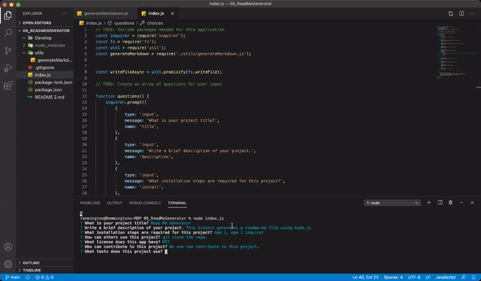

# Read Me Generator
 
   

## Description
​This project generates a readme.md file using node.js 

## Table of Contents 

* [Installation](#installation)
​
* [Usage](#usage)
​
* [License](#license)
​
* [Contributing](#contributing)
​
* [Tests](#tests)
​
* [Questions](#questions)
​
## Installation
​
To install necessary dependencies, run the following command:
```
npm i 
npm i inquirer
```

## Usage
​
git clone the repo. . 
​
​
## License
  ​

<br>
This project is licensed under the MIT license. 
Additional information on this license [here](MIT).
  
## Contributing
​
No one can contribute to this repository. 
​
## Tests
​
This project uses no tests. 
​
## Questions
​
If you have any questions, please contact me directly at s.pascone@knights.ucf.edu.
More of my work can be found at [rmmngtn](https://github.com/rmmngtn).

## Screenshots





### Screen Recorder Link
<https://drive.google.com/file/d/1boXQ1DeB-TbbwW0sDWZzhqsJW_w_M6GM/view?usp=sharing>


  